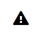

## react-octicon

A [React](https://facebook.github.io/react/) component which renders a [GitHub Octicons](https://octicons.github.com/) icon.



### Demo

https://insin.github.io/react-octicon/

### Usage

**Note: [webpack](http://webpack.github.io/) is _required_ in order to use this component.**

This component handles the Octicons CSS dependency for you, but you must use webpack and configure it to handle CSS and associated font and image files.
For example, using the following webpack loaders:

```
npm install --save-dev css-loader file-loader style-loader url-loader
```

```js
 module: {
   loaders: [
     /* ...other loader config here... */
     {test: /\.css$/, loader: 'style!css'},
     {test: /\.(otf|eot|svg|ttf|woff|woff2).*$/, loader: 'url?limit=8192'}
   ]
 }
```

See the [webpack Stylesheets documentation](http://webpack.github.io/docs/stylesheets.html) for more info.

----

Install and use the Octicon component like so:

```
npm install --save react-octicon
```

```js
var React = require('react')
var Octicon = require('react-octicon')

React.render(<Octicon name="sync" spin/>, document.querySelector('#app'))
```

### Required props

Prop | Description
---- | -------------
name | The name of an icon in the Octicons set, e.g. `'trashcan'`

### Other props

Prop | Description
---- | -------------
className | An additional class name for the element rendered by the component
mega | If `true`, a double-size icon will be displayed
spin | If `true`, the icon will spin

Any additional props given, such as event handlers or aria attributes, will be passed to the element rendered by the component.

## MIT licensed
